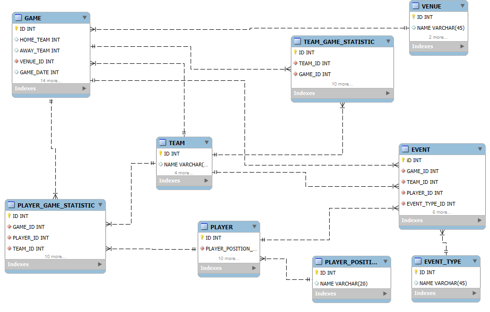
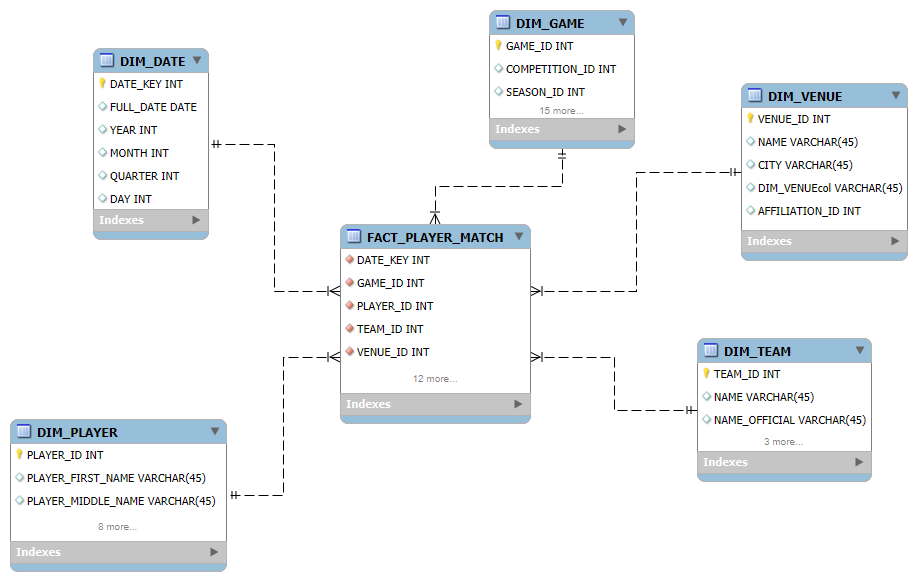

# ELT proces a dátový sklad (DWH) v Snowflake – Opta Data: Football (EPL SAMPLE)

Tento projekt implementuje **ELT proces v Snowflake** pre dataset zo **Snowflake Marketplace** a vytvára **dimenzionálny model (Star Schema)**. Cieľom je analyzovať výkonnosť hráčov a tímov v zápasoch (góly, strely, prihrávky) a prezentovať výsledky pomocou vizualizácií.

* * *

## 1️⃣ Úvod a popis zdrojových dát

### Téma a účel analýzy
Projekt je zameraný na futbalové dáta (EPL) s cieľom:
- identifikovať najproduktívnejších hráčov (góly, strely na bránu),
- porovnať tímy podľa produktivity (strely vs góly),
- analyzovať kvalitu hry cez presnosť prihrávok,
- vizualizovať kľúčové metriky v prehľadných grafoch.

### Prečo tento dataset
Dataset poskytuje:
- základné entity (zápas, hráč, tím, štadión),
- agregované štatistiky hráčov v zápase,
- referenčné číselníky (napr. typ udalosti, pozícia).

### Biznis proces
Analýza športovej výkonnosti (performance analytics):
- reporting kľúčových metrík hráčov a tímov,
- porovnanie tímov a hráčov podľa výkonu,
- podpora tvorby obsahu (match insights).

### Zdrojové dáta (Snowflake Marketplace)
Dataset pochádza zo **Snowflake Marketplace**:

- **Shared database:** `OPTA_DATA_FOOTBALL__SAMPLE`
- **Schema:** `EPL`

> Poznámka: Marketplace databáza je **shared** – nie je možné v nej vytvárať vlastné objekty. Preto sa údaje kopírujú do vlastnej DB ako staging tabuľky.

### Prehľad použitých objektov (core + reference)
Core (použité v ERD a transformáciách):
- `GAME`
- `EVENT`
- `PLAYER`
- `TEAM`
- `VENUE`
- `PLAYER_GAME_STATISTIC`
- `TEAM_GAME_STATISTIC`

Reference (pre úplnejšie vzťahy):
- `EVENT_TYPE`
- `PLAYER_POSITION`

### ERD diagram pôvodnej dátovej štruktúry


* * *

## 2️⃣ Návrh dimenzionálneho modelu (Star Schema)

Vytvorený je model hviezdy (Star Schema) so zameraním na grain **hráč × zápas**.

### Star Schema diagram


### Faktová tabuľka
**FACT_PLAYER_MATCH**
- **Grain:** 1 riadok = 1 hráč v 1 zápase
- **FK:** `DATE_KEY`, `GAME_ID`, `PLAYER_ID`, `TEAM_ID`
- **Metriky (vybrané):**
  - `GOALS`, `OWN_GOALS`
  - `TOTAL_SCORING_ATT`, `ONTARGET_SCORING_ATT`, `BLOCKED_SCORING_ATT`, `POST_SCORING_ATT`
  - `TOTAL_PASS`, `ACCURATE_PASS`
  - `TOTAL_CROSS`, `ACCURATE_CROSS`

✅ Povinná požiadavka: **window functions vo faktovej tabuľke**
- `RANK() OVER (PARTITION BY GAME_ID ORDER BY GOALS DESC, ONTARGET_SCORING_ATT DESC, TOTAL_SCORING_ATT DESC) AS RANK_IN_GAME`
- `SUM(GOALS) OVER (PARTITION BY PLAYER_ID ORDER BY GAME_DAY ROWS BETWEEN UNBOUNDED PRECEDING AND CURRENT ROW) AS PLAYER_GOALS_CUMULATIVE`

### Dimenzie + SCD typ
- **DIM_DATE** – kalendár (SCD Type 0)
- **DIM_GAME** – zápas (SCD Type 0/1)
- **DIM_PLAYER** – hráči (SCD Type 1)
- **DIM_TEAM** – tímy (SCD Type 1)
- **DIM_VENUE** – štadióny (SCD Type 1)

* * *

## 3️⃣ ELT proces v Snowflake

### 📥 Extract (Marketplace → STAGING)

#### 1) Vytvorenie vlastnej DB a schém
```sql
CREATE OR REPLACE DATABASE FOOTBALL_DWH;
CREATE OR REPLACE SCHEMA FOOTBALL_DWH.STAGING;
CREATE OR REPLACE SCHEMA FOOTBALL_DWH.DWH;
```

#### 2) Vytvorenie staging tabuliek (CTAS) zo shared database
```sql
CREATE OR REPLACE TABLE FOOTBALL_DWH.STAGING.STG_GAME AS
SELECT * FROM OPTA_DATA_FOOTBALL__SAMPLE.EPL.GAME;

CREATE OR REPLACE TABLE FOOTBALL_DWH.STAGING.STG_EVENT AS
SELECT * FROM OPTA_DATA_FOOTBALL__SAMPLE.EPL.EVENT;

CREATE OR REPLACE TABLE FOOTBALL_DWH.STAGING.STG_PLAYER AS
SELECT * FROM OPTA_DATA_FOOTBALL__SAMPLE.EPL.PLAYER;

CREATE OR REPLACE TABLE FOOTBALL_DWH.STAGING.STG_TEAM AS
SELECT * FROM OPTA_DATA_FOOTBALL__SAMPLE.EPL.TEAM;

CREATE OR REPLACE TABLE FOOTBALL_DWH.STAGING.STG_VENUE AS
SELECT * FROM OPTA_DATA_FOOTBALL__SAMPLE.EPL.VENUE;

CREATE OR REPLACE TABLE FOOTBALL_DWH.STAGING.STG_PLAYER_GAME_STATISTIC AS
SELECT * FROM OPTA_DATA_FOOTBALL__SAMPLE.EPL.PLAYER_GAME_STATISTIC;

CREATE OR REPLACE TABLE FOOTBALL_DWH.STAGING.STG_TEAM_GAME_STATISTIC AS
SELECT * FROM OPTA_DATA_FOOTBALL__SAMPLE.EPL.TEAM_GAME_STATISTIC;

CREATE OR REPLACE TABLE FOOTBALL_DWH.STAGING.STG_EVENT_TYPE AS
SELECT * FROM OPTA_DATA_FOOTBALL__SAMPLE.EPL.EVENT_TYPE;

CREATE OR REPLACE TABLE FOOTBALL_DWH.STAGING.STG_PLAYER_POSITION AS
SELECT * FROM OPTA_DATA_FOOTBALL__SAMPLE.EPL.PLAYER_POSITION;
```

### ⚙️ Transform + 📤 Load (STAGING → DWH)

#### DIM_DATE
```sql
CREATE OR REPLACE TABLE FOOTBALL_DWH.DWH.DIM_DATE AS
SELECT DISTINCT
  TO_NUMBER(TO_CHAR(TO_DATE(GAME_DATE), 'YYYYMMDD')) AS DATE_KEY,
  TO_DATE(GAME_DATE)                                 AS FULL_DATE,
  YEAR(TO_DATE(GAME_DATE))                           AS YEAR,
  MONTH(TO_DATE(GAME_DATE))                          AS MONTH,
  QUARTER(TO_DATE(GAME_DATE))                        AS QUARTER,
  DAY(TO_DATE(GAME_DATE))                            AS DAY
FROM FOOTBALL_DWH.STAGING.STG_GAME
WHERE GAME_DATE IS NOT NULL;
```

#### DIM_GAME
```sql
CREATE OR REPLACE TABLE FOOTBALL_DWH.DWH.DIM_GAME AS
SELECT
  ID AS GAME_ID,
  COMPETITION_ID,
  SEASON_ID,
  VENUE_ID,
  HOME_TEAM AS HOME_TEAM_ID,
  AWAY_TEAM AS AWAY_TEAM_ID,
  ATTENDANCE,
  GAME_DATE,
  MATCHDAY,
  GAME_STATE_ID,
  HOME_SCORE,
  HOME_ET_SCORE,
  HOME_FH_SCORE,
  HOME_PEN_SCORE,
  AWAY_SCORE,
  AWAY_ET_SCORE,
  AWAY_FH_SCORE,
  AWAY_PEN_SCORE
FROM FOOTBALL_DWH.STAGING.STG_GAME;
```

#### DIM_TEAM
```sql
CREATE OR REPLACE TABLE FOOTBALL_DWH.DWH.DIM_TEAM AS
SELECT
  ID AS TEAM_ID,
  * EXCLUDE (ID)
FROM FOOTBALL_DWH.STAGING.STG_TEAM;
```

#### DIM_PLAYER
```sql
CREATE OR REPLACE TABLE FOOTBALL_DWH.DWH.DIM_PLAYER AS
SELECT
  ID AS PLAYER_ID,
  * EXCLUDE (ID)
FROM FOOTBALL_DWH.STAGING.STG_PLAYER;
```

#### DIM_VENUE
```sql
CREATE OR REPLACE TABLE FOOTBALL_DWH.DWH.DIM_VENUE AS
SELECT
  ID AS VENUE_ID,
  * EXCLUDE (ID)
FROM FOOTBALL_DWH.STAGING.STG_VENUE;
```

#### FACT_PLAYER_MATCH (povinné window functions)
```sql
CREATE OR REPLACE TABLE FOOTBALL_DWH.DWH.FACT_PLAYER_MATCH AS
WITH base AS (
  SELECT
    pgs.GAME_ID,
    pgs.PLAYER_ID,
    pgs.TEAM_ID,
    TO_DATE(g.GAME_DATE) AS GAME_DAY,

    pgs.GOALS,
    pgs.OWN_GOALS,
    pgs.TOTAL_SCORING_ATT,
    pgs.ONTARGET_SCORING_ATT,
    pgs.BLOCKED_SCORING_ATT,
    pgs.POST_SCORING_ATT,
    pgs.TOTAL_PASS,
    pgs.ACCURATE_PASS,
    pgs.TOTAL_CROSS,
    pgs.ACCURATE_CROSS
  FROM FOOTBALL_DWH.STAGING.STG_PLAYER_GAME_STATISTIC pgs
  JOIN FOOTBALL_DWH.STAGING.STG_GAME g
    ON g.ID = pgs.GAME_ID
)
SELECT
  TO_NUMBER(TO_CHAR(GAME_DAY, 'YYYYMMDD')) AS DATE_KEY,
  GAME_ID,
  PLAYER_ID,
  TEAM_ID,

  GOALS,
  OWN_GOALS,
  TOTAL_SCORING_ATT,
  ONTARGET_SCORING_ATT,
  BLOCKED_SCORING_ATT,
  POST_SCORING_ATT,
  TOTAL_PASS,
  ACCURATE_PASS,
  TOTAL_CROSS,
  ACCURATE_CROSS,

  -- Window #1: rank hráča v rámci zápasu
  RANK() OVER (
    PARTITION BY GAME_ID
    ORDER BY GOALS DESC, ONTARGET_SCORING_ATT DESC, TOTAL_SCORING_ATT DESC
  ) AS RANK_IN_GAME,

  -- Window #2: kumulatívne góly hráča v čase
  SUM(GOALS) OVER (
    PARTITION BY PLAYER_ID
    ORDER BY GAME_DAY
    ROWS BETWEEN UNBOUNDED PRECEDING AND CURRENT ROW
  ) AS PLAYER_GOALS_CUMULATIVE
FROM base;
```

### ✅ Validácia výsledkov
Kontrola duplicít na grain (PLAYER_ID, GAME_ID):
```sql
SELECT PLAYER_ID, GAME_ID, COUNT(*)
FROM FOOTBALL_DWH.DWH.FACT_PLAYER_MATCH
GROUP BY 1,2
HAVING COUNT(*) > 1;
```

Kontrola NULL kľúčov:
```sql
SELECT COUNT(*) AS bad_rows
FROM FOOTBALL_DWH.DWH.FACT_PLAYER_MATCH
WHERE DATE_KEY IS NULL OR GAME_ID IS NULL OR PLAYER_ID IS NULL OR TEAM_ID IS NULL;
```

* * *

## 4️⃣ Vizualizácia dát

Nižšie je 6 vizualizácií. Pre každý graf je uvedený SQL dotaz, obrázok a interpretácia.


### Graf 1: Top 10 strelcov (najviac gólov)
```sql
SELECT
  COALESCE(p.PLAYER_KNOWN_NAME, p.PLAYER_FIRST_NAME || ' ' || p.PLAYER_LAST_NAME, 'Unknown') AS player_name,
  SUM(f.GOALS) AS total_goals
FROM FACT_PLAYER_MATCH f
JOIN DIM_PLAYER p ON p.PLAYER_ID = f.PLAYER_ID
GROUP BY 1
HAVING SUM(f.GOALS) > 0
ORDER BY total_goals DESC
LIMIT 10;
```

**Interpretácia:** Graf zobrazuje 10 hráčov s najvyšším počtom gólov v analyzovanom výbere zápasov. Vizualizácia umožňuje rýchlo identifikovať najproduktívnejších zakončovateľov a porovnať rozdiely medzi hráčmi. Na grafe je typicky vidieť, že niekoľko hráčov výrazne vyčnieva a vytvára “top skupinu”, zatiaľ čo zvyšok rebríčka má často podobné hodnoty. Tento výsledok je užitočný napríklad pri športovom reportingu (kto bol najefektívnejší strelec v dostupných dátach) alebo pri porovnaní hráčov na základe ofenzívneho prínosu.

* * *

### Graf 2: Top 10 hráčov podľa presnosti prihrávok (min. 50 prihrávok)
```sql
SELECT
  COALESCE(
    p.PLAYER_KNOWN_NAME,
    p.PLAYER_FIRST_NAME || ' ' || p.PLAYER_LAST_NAME,
    p.PLAYER_LAST_NAME,
    p.PLAYER_FIRST_NAME,
    'Unknown'
  ) AS player_name,
  SUM(f.ACCURATE_PASS) AS accurate_passes,
  SUM(f.TOTAL_PASS) AS total_passes,
  (SUM(f.ACCURATE_PASS) / NULLIF(SUM(f.TOTAL_PASS), 0))::FLOAT AS pass_accuracy
FROM FACT_PLAYER_MATCH f
JOIN DIM_PLAYER p ON p.PLAYER_ID = f.PLAYER_ID
GROUP BY 1
HAVING SUM(f.TOTAL_PASS) >= 50
ORDER BY pass_accuracy DESC
LIMIT 10;
```

**Interpretácia:** Graf porovnáva hráčov podľa presnosti prihrávok (pass accuracy), ktorá je vypočítaná ako podiel presných prihrávok a celkového počtu prihrávok. Zároveň je použitý filter na minimálne 50 prihrávok, aby výsledok nebol skreslený hráčmi s nízkym počtom akcií (napríklad hráč s 2 prihrávkami by mohol mať 100% presnosť, ale taký výsledok nie je reprezentatívny). Vizualizácia pomáha odhaliť hráčov, ktorí sú nielen aktívni v rozohrávke, ale dokážu si udržať aj vysokú presnosť. V praxi môže tento graf naznačiť rozdiely medzi typmi hráčov (napr. defenzívni záložníci vs. útočníci) alebo štýl hry tímu.

* * *

### Graf 3: Najviac striel na bránu podľa hráčov (Top 15)
```sql
SELECT
  COALESCE(
    p.PLAYER_KNOWN_NAME,
    p.PLAYER_FIRST_NAME || ' ' || p.PLAYER_LAST_NAME,
    p.PLAYER_LAST_NAME,
    p.PLAYER_FIRST_NAME,
    'Unknown'
  ) AS player_name,
  SUM(f.ONTARGET_SCORING_ATT) AS on_target_shots,
  SUM(f.TOTAL_SCORING_ATT) AS total_shots
FROM FACT_PLAYER_MATCH f
JOIN DIM_PLAYER p ON p.PLAYER_ID = f.PLAYER_ID
GROUP BY 1
HAVING SUM(f.ONTARGET_SCORING_ATT) > 0
ORDER BY on_target_shots DESC, total_shots DESC
LIMIT 15;
```

**Interpretácia:** Tento graf zobrazuje hráčov s najvyšším počtom striel na bránu (on-target shots) a zároveň aj celkový počet striel. Vďaka tomu je možné posúdiť nielen aktivitu hráča (koľko strieľa), ale aj presnosť zakončenia (koľko striel smerovalo na bránu). Z vizualizácie býva vidieť, že niektorí hráči majú vysoký počet striel na bránu aj pri relatívne menšom celkovom počte pokusov, čo môže naznačovať efektívne zakončenie. Naopak, hráči s veľkým počtom striel, ale nižším počtom striel na bránu môžu mať “menej presné” zakončenie. Tento graf je vhodný na rýchle porovnanie ofenzívneho štýlu hráčov.

* * *

### Graf 4: Tímy s najvyšším počtom gólov
```sql
SELECT
  t.NAME AS team_name,
  SUM(f.GOALS) AS team_goals
FROM FACT_PLAYER_MATCH f
JOIN DIM_TEAM t ON t.TEAM_ID = f.TEAM_ID
GROUP BY 1
ORDER BY team_goals DESC;
```

**Interpretácia:** Graf zobrazuje porovnanie tímov podľa celkového počtu gólov v analyzovanom výbere. Keďže faktová tabuľka je na úrovni hráč × zápas, góly tímu vznikajú agregáciou výkonov hráčov v rámci zápasov. Vizualizácia pomáha identifikovať tímy s najvyššou ofenzívnou produktivitou. Typicky je možné pozorovať, že najlepšie tímy dosahujú výrazne viac gólov než zvyšok, čo môže súvisieť so silou útoku, štýlom hry alebo kvalitou súperov v dostupných dátach. Tento graf je vhodný ako základná “league performance” metrika pre report.

* * *

### Graf 5: Vzťah medzi strelami a gólmi (scatter pre tímy)
```sql
SELECT
  t.NAME AS team_name,
  SUM(f.TOTAL_SCORING_ATT) AS total_shots,
  SUM(f.GOALS) AS team_goals,
  SUM(f.ONTARGET_SCORING_ATT) AS on_target_shots
FROM FACT_PLAYER_MATCH f
JOIN DIM_TEAM t ON t.TEAM_ID = f.TEAM_ID
GROUP BY 1
ORDER BY total_shots DESC;
```

**Interpretácia:** Scatter graf zobrazuje vzťah medzi počtom striel (X os) a počtom gólov (Y os) na úrovni tímov. Cieľom je zistiť, či tímy, ktoré viac strieľajú, aj viac skórujú, alebo či sú efektívnejšie tímy, ktoré síce strieľajú menej, ale premieňajú viac šancí. Z grafu býva možné identifikovať “outliers” — napríklad tím s vysokým počtom striel, ale relatívne nízkym počtom gólov (nižšia efektivita zakončenia), alebo naopak tím s menším počtom striel, ale vysokým počtom gólov (vyššia efektivita). Pridaná metrika striel na bránu môže slúžiť ako doplnkový indikátor kvality pokusov.

* * *

### Graf 6: Tímy podľa počtu presných prihrávok
```sql
SELECT
  t.NAME AS team_name,
  SUM(f.ACCURATE_PASS) AS team_accurate_passes
FROM FACT_PLAYER_MATCH f
JOIN DIM_TEAM t ON t.TEAM_ID = f.TEAM_ID
GROUP BY 1
ORDER BY team_accurate_passes DESC;
```

**Interpretácia:** Tento graf porovnáva tímy podľa celkového počtu presných prihrávok. Na rozdiel od presnosti prihrávok (percento) ide o metrický pohľad na objem — ktoré tímy majú najviac úspešných prihrávok. Výsledok môže naznačovať štýl hry: tímy s vyšším počtom presných prihrávok často držia loptu dlhšie, viac kombinujú a budujú útok postupne. Naopak, tímy s nižším počtom presných prihrávok môžu hrať priamočiarejšie (dlhé lopty, rýchle protiútoky) alebo môžu mať v zápasoch menej držania lopty. Graf je dobrý na porovnanie tímového “passing volume”.

* * *

## 5️⃣ Štruktúra repozitára

- `/sql/` → ELT skripty (Extract, Load, Transform, Validations, Viz)
- `/img/` → ERD, Star Schema, grafy
- `README.md` → dokumentácia projektu

* * *

### Autors: Rinat Nevesenko, Yehor Forostiuk
